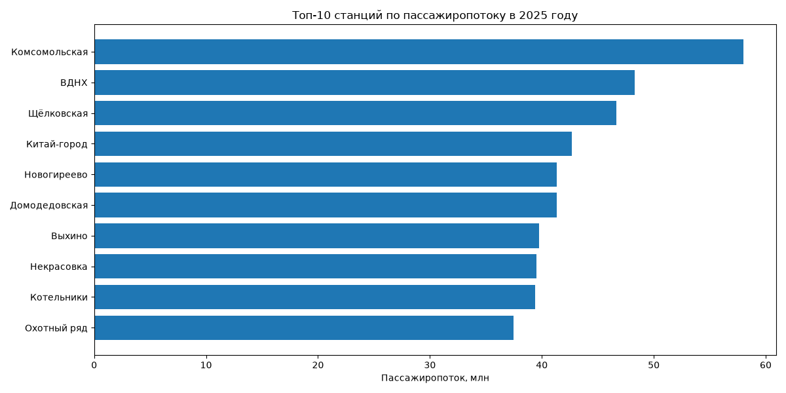
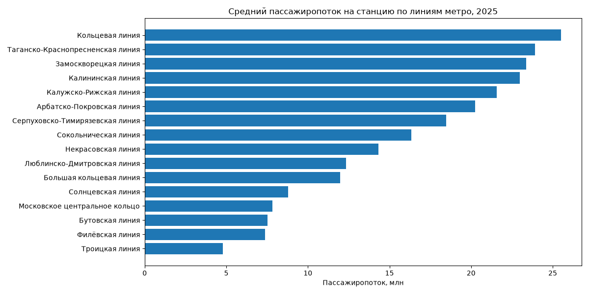
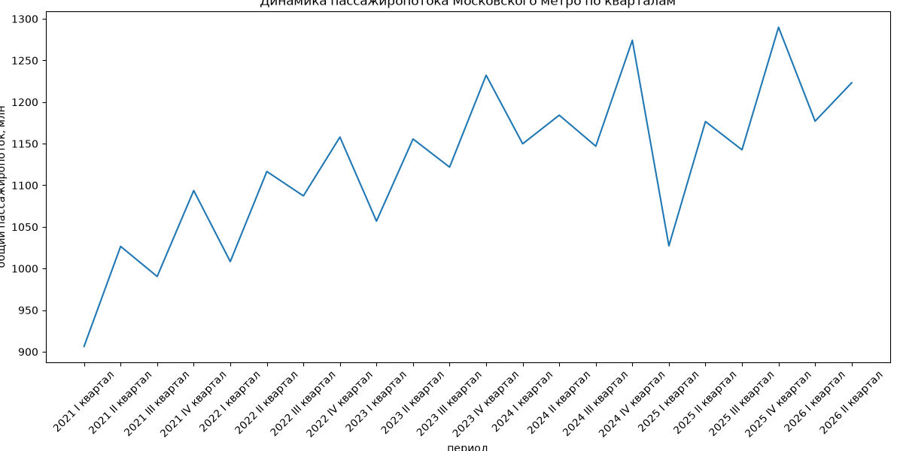

# Анализ пассажиропотока Московского метро

В этом проекте используются открытые данные о пассажиропотоке Московского метрополитена за 2021–2026 годы. Данные за 2026 год неполные, поэтому основная часть сравнений станций и линий проводится по 2025 году.

Для анализа взяты два набора данных: пассажиропоток по станциям и данные о входах и выходах станций метро. Во втором наборе одна станция может встречаться несколько раз, так как у неё может быть несколько входов. Поэтому для каждой станции и линии сначала были рассчитаны средние координаты, после чего данные были объединены с таблицей пассажиропотока.

Перед анализом из таблиц были удалены лишние строки и столбцы, числовые значения приведены к нужным типам. Также были проверены пропуски и дубликаты.

Общий пассажиропоток станции считается как сумма входящих и выходящих пассажиров.

## Пассажиропоток станций в 2025 году

Для каждой станции был рассчитан суммарный пассажиропоток за 2025 год.

Наибольшее значение получилось у станции **Комсомольская Кольцевой линии** — около 58 млн входящих и выходящих пассажиров за год.



При поиске станций с минимальным пассажиропотоком учитывались только станции, для которых были данные за все четыре квартала. Записи с нулевым пассажиропотоком также не использовались, так как такие значения могут быть связаны с особенностями исходных данных.

## Сравнение линий

Сначала был рассчитан общий пассажиропоток каждой линии. Но этот показатель сильно зависит от количества станций на линии, поэтому дополнительно был рассчитан средний годовой пассажиропоток одной станции.

По этому показателю наибольшее значение в 2025 году получилось у Кольцевой линии.



## Изменение пассажиропотока по кварталам

Чтобы посмотреть изменение пассажиропотока во времени, данные были сгруппированы по годам и кварталам.



Для полных лет с 2021 по 2025 год в среднем минимальный пассажиропоток приходится на I квартал, а максимальный — на IV квартал.

Также на графике заметен рост общего пассажиропотока по годам. При этом напрямую связывать его только с увеличением числа пассажиров нельзя, так как за это время сеть метро также расширялась.

## Карта

Для данных за 2025 год была построена интерактивная карта станций.

[Открыть карту](metro_map.html)

Размер кружка на карте зависит от пассажиропотока станции. При нажатии можно посмотреть название станции, линию и значение пассажиропотока.

Станции, для которых не удалось найти координаты, на карту не добавлялись. Также были исключены записи с нулевым пассажиропотоком.

## Структура проекта

```text
moscow-metro-analysis/
├── data/
│   ├── passenger_flow.csv
│   └── metro_entrances.csv
├── images/
│   ├── quarterly_passenger_flow.png
│   ├── top_10_stations_2025.png
│   └── avg_station_flow_by_line_2025.png
├── analysis.py
├── metro_map.html
├── requirements.txt
└── README.md
```

Для работы используются Python, pandas, matplotlib и folium.

## Запуск

Сначала нужно установить зависимости:

```bash
pip install -r requirements.txt
```

После этого запустить:

```bash
python analysis.py
```

Скрипт создаёт графики в папке `images` и интерактивную карту `metro_map.html`.